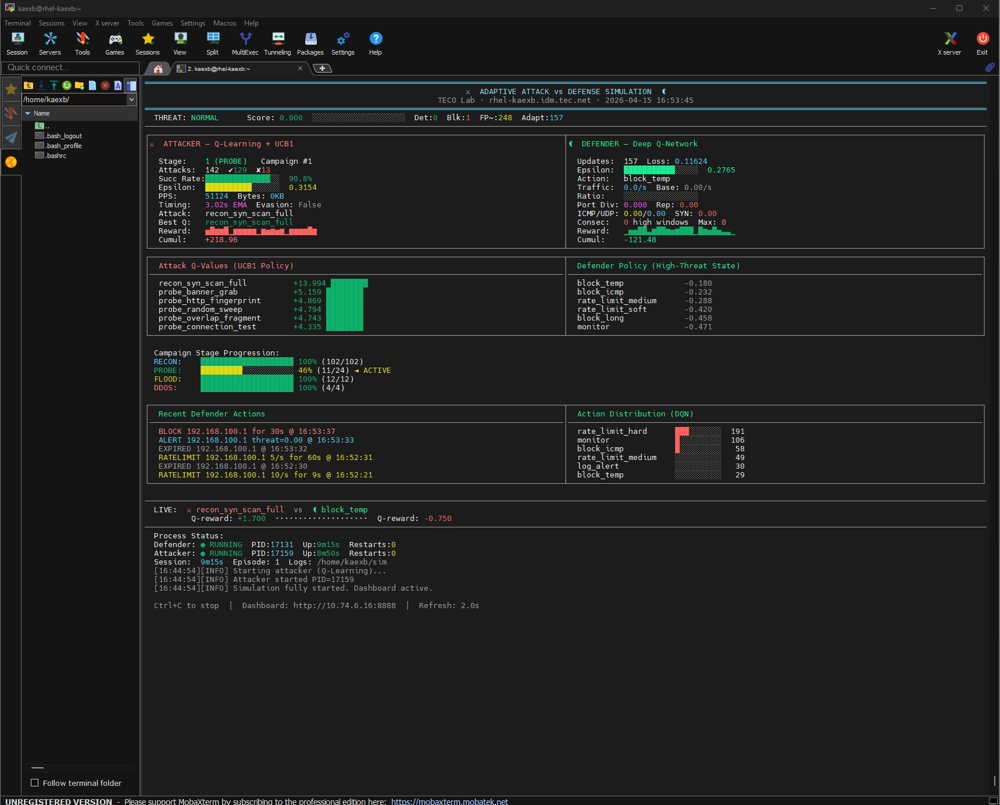
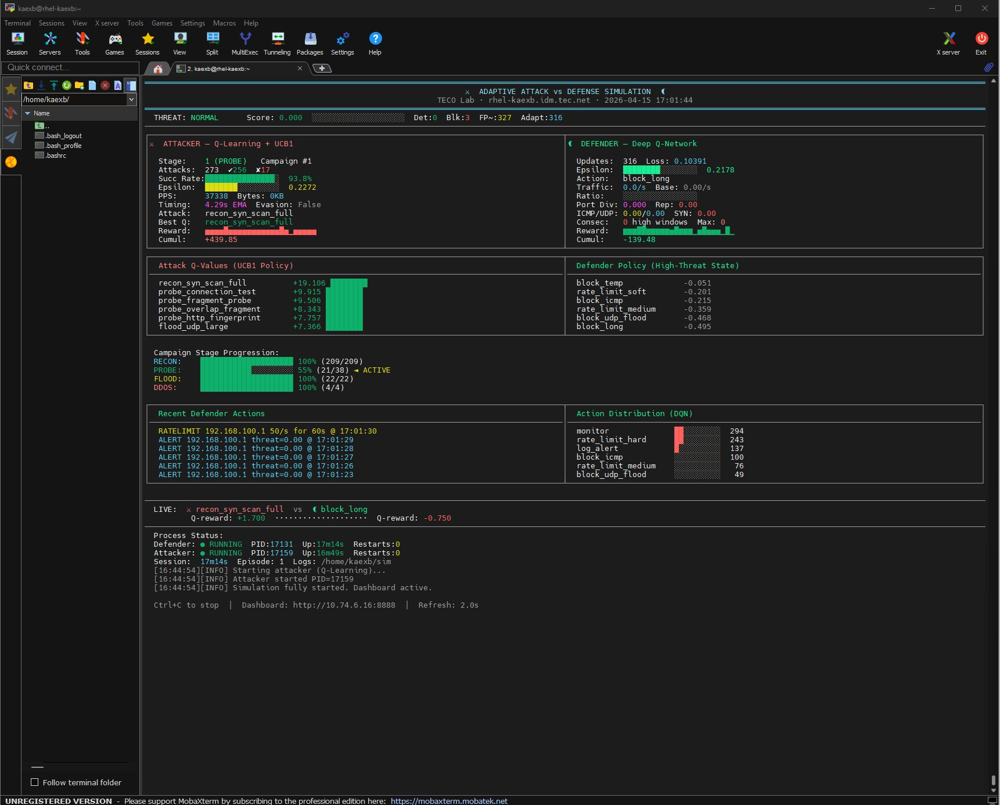
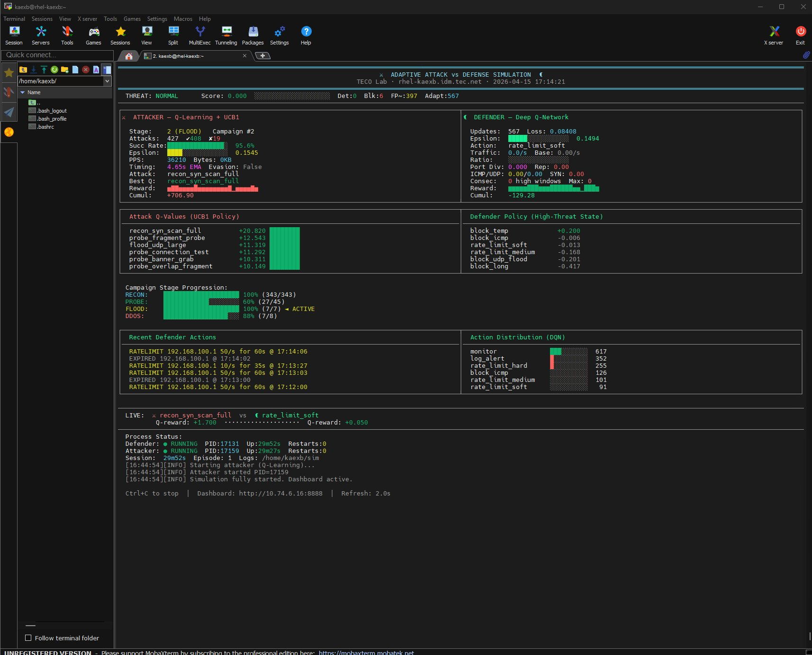
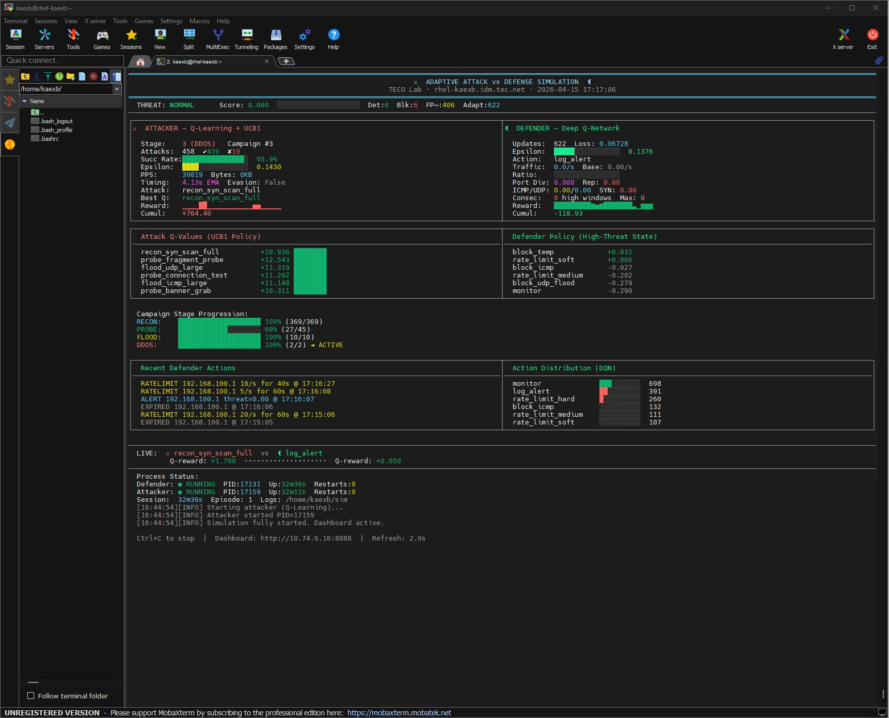

# Adaptive Attack vs Defense Simulation

A reinforcement learning network security simulation built on RHEL 9.
An adaptive attacker (Q-Learning + UCB1 bandit) and an adaptive defender
(Deep Q-Network with experience replay) compete in real time inside isolated
Linux network namespaces connected by a GRE-over-IPSec tunnel.

No scapy. No hping3. No internet. Real raw sockets, real nftables rules,
real IP/TCP/UDP/ICMP packets built from scratch using Python `struct`.

-----

## Architecture

```
┌─────────────────────────────────────────────────────────┐
│                  RHEL 9 VM (rhel-kaexb)                 │
│                                                         │
│  ┌──────────────┐   GRE-over-IPSec    ┌──────────────┐ │
│  │  namespace   │◄───────────────────►│  namespace   │ │
│  │    "left"    │   192.168.100.0/30  │   "right"    │ │
│  │  (attacker)  │                     │  (defender)  │ │
│  └──────────────┘                     └──────────────┘ │
│         │                                    │          │
│  Q-Learning +                         Deep Q-Network    │
│  UCB1 Bandit                          + nftables        │
│  28 attack types                      9 defense actions │
│  4 campaign stages                    12-feature state  │
└─────────────────────────────────────────────────────────┘
```

**packet_engine.py** — Raw socket packet construction from scratch.
Builds real IPv4/TCP/UDP/ICMP headers using `struct` with proper checksums.
SYN/ACK/RST/FIN/XMAS/NULL floods, IP fragmentation, HTTP GET floods,
DNS queries, NTP monlist, Slowloris, overlapping fragments.

**attacker2.py** — Q-Learning agent with UCB1 exploration bonus.
28 attacks across 4 escalating stages: RECON → PROBE → FLOOD → DDOS.
Reward shaping based on packets sent, defender alert level, and stage.
Auto-escalates stage when success rate > 60%, de-escalates when < 20%.
Evasion mode activates when defender reaches CRITICAL alert.

**defender2.py** — Linear function approximation DQN using numpy.
12-dimensional state vector (rate anomaly, port diversity, protocol ratios,
reputation, alert level, sustained attack counter).
8 actions: monitor, log_alert, rate_limit_soft/medium/hard,
block_icmp, block_udp, block_temp, block_long.
Experience replay buffer (2000 transitions), soft target network updates
every 25 steps, per-action reward tracking.

**supervisor2.py** — Episode manager and live terminal dashboard.
Launches defender first (25s baseline warmup), then attacker.
Process health monitoring with auto-restart. Sparklines, Q-value tables,
stage progression bars, action distribution histograms.

**dashboard.html + server.py** — Browser dashboard on port 8888.
Polls /state endpoint every 3 seconds. Q-tables, DQN policy,
reward curves, live engagement view.

-----

## Learning Progression

The simulation was observed over ~32 minutes on first run.

### t=0:00 — Simulation starts

Defender establishes traffic baseline (25s warmup).
Attacker begins with random exploration (ε=0.45).

### t=9:00 — Early learning



Attacker: Stage 1 (PROBE), 90.8% success rate, cumulative reward +218.
`recon_syn_scan_full` emerges as top attack (Q=+13.994).
Defender: All policy Q-values negative. 248 false positives.
The attacker figured out that slow recon doesn’t trigger the anomaly
detector — the defender sees NORMAL threat and gets penalized for blocking.
Classic false positive avoidance causing under-detection.

### t=17:00 — Feedback loop



Attacker: 93.8% success, cumulative +439, `recon_syn_scan_full` Q=+19.106.
The attacker is locked in a positive feedback loop — recon keeps working,
Q-table keeps rewarding it, epsilon decays so it exploits more.
Defender: Still mostly negative. `monitor` becomes most-used action (294x)
as the DQN learns that blocking during low threat = penalty.

### t=29:00 — Inflection point



Attacker escalates to Stage 2 (FLOOD) → Campaign #2.
Flood attacks generate real traffic volume, threat score spikes.
**Defender `block_temp` goes positive for the first time: +0.200.**
The DQN finally gets positive reward signals. DQN loss dropping: 0.116 → 0.084.

### t=32:00 — Convergence beginning



Attacker at Stage 3 (DDOS), Campaign #3. 95.9% success.
**Defender now has TWO positive Q-values: `block_temp` +0.032, `rate_limit_soft` +0.006.**
DQN loss: 0.067. 622 updates. Policy beginning to converge.
The two agents are finally competing meaningfully.

-----

## Installation

This was built entirely offline — the VM has no outbound internet access.
All packages were downloaded on a Windows host and SCP’d to the VM.

### Prerequisites

- RHEL 9 VM (tested on 9.6 Plow)
- Python 3.9
- numpy (offline RPM install — see dependency chain below)
- ncat (for listeners and probing)
- nftables
- Two network namespaces with GRE-over-IPSec tunnel

### The Offline Dependency Chain

Getting numpy working on an unregistered RHEL 9 VM with no internet
required manually resolving a chain of missing shared libraries:

```
python3-numpy-1.23.5
  └── libflexiblas.so.3       → flexiblas-3.0.4-8.el9.0.1.x86_64.rpm
        └── libflexiblas backend → flexiblas-netlib-3.0.4-8.el9.0.1.x86_64.rpm
              └── libgfortran.so.5  → libgfortran-11.5.0-11.el9.x86_64.rpm (BaseOS)
                    └── libquadmath.so.0 → libquadmath-11.5.0-11.el9.x86_64.rpm (BaseOS)
                          └── libflexiblas backend → flexiblas-openblas-openmp-3.0.4-8.el9.0.1.x86_64.rpm
```

All RPMs sourced from `https://dl.rockylinux.org/pub/rocky/9/` (Rocky Linux 9
is binary-compatible with RHEL 9).

Install order:

```bash
sudo rpm -ivh --nodeps flexiblas.rpm flexiblas-netlib.rpm
sudo rpm -ivh --nodeps libgfortran.rpm
sudo rpm -ivh --nodeps libquadmath.rpm
sudo rpm -ivh --nodeps flexiblas-openblas-openmp.rpm
sudo rpm -ivh --nodeps numpy.rpm
python3 -c "import numpy; print(numpy.__version__)"  # 1.23.5
```

### Network Namespace Setup

The GRE-over-IPSec tunnel setup (Lab 1 from the original exercise):

```bash
# Create namespaces
sudo ip netns add left
sudo ip netns add right

# veth pair connecting them
sudo ip link add veth-left type veth peer name veth-right
sudo ip link set veth-left netns left
sudo ip link set veth-right netns right

# Addresses
sudo ip netns exec left  ip addr add 192.168.100.1/30 dev veth-left
sudo ip netns exec right ip addr add 192.168.100.2/30 dev veth-right
sudo ip netns exec left  ip link set veth-left up
sudo ip netns exec right ip link set veth-right up

# GRE tunnel
sudo ip netns exec left  ip tunnel add gre1 mode gre local 192.168.100.1 remote 192.168.100.2
sudo ip netns exec right ip tunnel add gre1 mode gre local 192.168.100.2 remote 192.168.100.1
```

IPSec via `ip xfrm` (manual SA, AES-256-CBC + HMAC-SHA256) with
PKI using certutil + libreswan NSS database. See Lab 1 SOP for full setup.

### Running

```bash
# Terminal 1 — simulation (use tmux to persist after disconnect)
tmux new -s sim
sudo python3 /home/kaexb/supervisor2.py

# Terminal 2 — browser dashboard
tmux new -s dash
python3 /home/kaexb/server.py
# Access: http://<vm-ip>:8888
```

To preserve learned Q-tables across restarts:

```bash
# Comment out state-clearing lines in supervisor2.py
sed -i 's/os.remove(path)/#os.remove(path)/' /home/kaexb/supervisor2.py
```

-----

## File Structure

```
/home/kaexb/
├── packet_engine.py     # Raw socket packet builders + FloodEngine
├── attacker2.py         # Q-Learning attacker agent
├── defender2.py         # DQN defender agent
├── supervisor2.py       # Process supervisor + terminal dashboard
├── dashboard.html       # Browser dashboard UI
├── server.py            # HTTP server for dashboard
└── sim/
    ├── shared_state.json       # Live state (attacker + defender)
    ├── attacker_state.json     # Q-table, epsilon, stage, timing EMA
    ├── defender_state.json     # DQN weights, replay buffer
    ├── attacker_history.jsonl  # Every attack event
    ├── defender_history.jsonl  # Every defense cycle
    ├── traffic.log             # Raw tcpdump output
    ├── attacker.log            # Attacker process log
    └── defender.log            # Defender process log
```

-----

## Context

This was built as part of a network engineering lab exercise at TECO
(Tampa Electric Company) TOC. The original exercise was a GRE-over-IPSec
tunnel lab — the simulation grew out of that as a way to explore adaptive
security concepts hands-on.

Labs completed in this environment:

- **Lab 1**: GRE-over-IPSec tunnel using Linux network namespaces
- **Lab 2**: Persistence via systemd + PKI with local CA (certutil + libreswan NSS)
- **Lab 3**: DISA STIG hardening with OpenSCAP (267 → 193 failures, 40% → 57% compliant)
- **Lab 4**: This simulation

All labs performed on an unregistered RHEL 9 VM with no outbound internet,
requiring manual offline RPM dependency resolution throughout.

-----

## Tech Stack

|Component          |Technology                                 |
|-------------------|-------------------------------------------|
|OS                 |RHEL 9.6 (Plow)                            |
|Language           |Python 3.9                                 |
|ML                 |numpy (linear DQN), Q-learning from scratch|
|Networking         |Raw sockets, nftables, GRE, IPSec (xfrm)   |
|Packet construction|struct (no scapy)                          |
|Monitoring         |tcpdump, custom EMA anomaly detection      |
|Dashboard          |Vanilla JS + HTML, Python http.server      |
|PKI                |certutil, libreswan NSS                    |
|Compliance         |OpenSCAP, DISA STIG for RHEL 9             |

-----

## Disclaimer

This is a contained lab simulation for educational purposes.
All traffic is between two network namespaces on a single VM.
Nothing leaves the host. Built to understand how adaptive attackers
and defenders learn from each other — not a production attack tool.